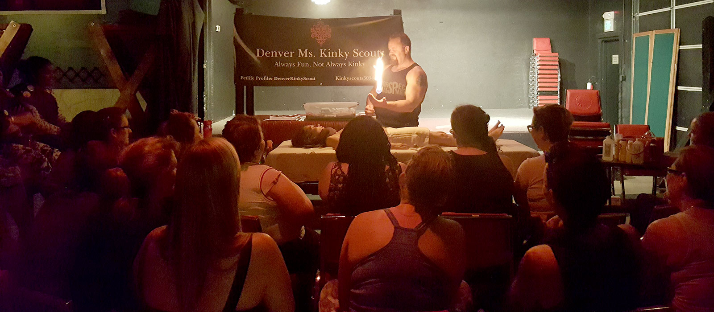
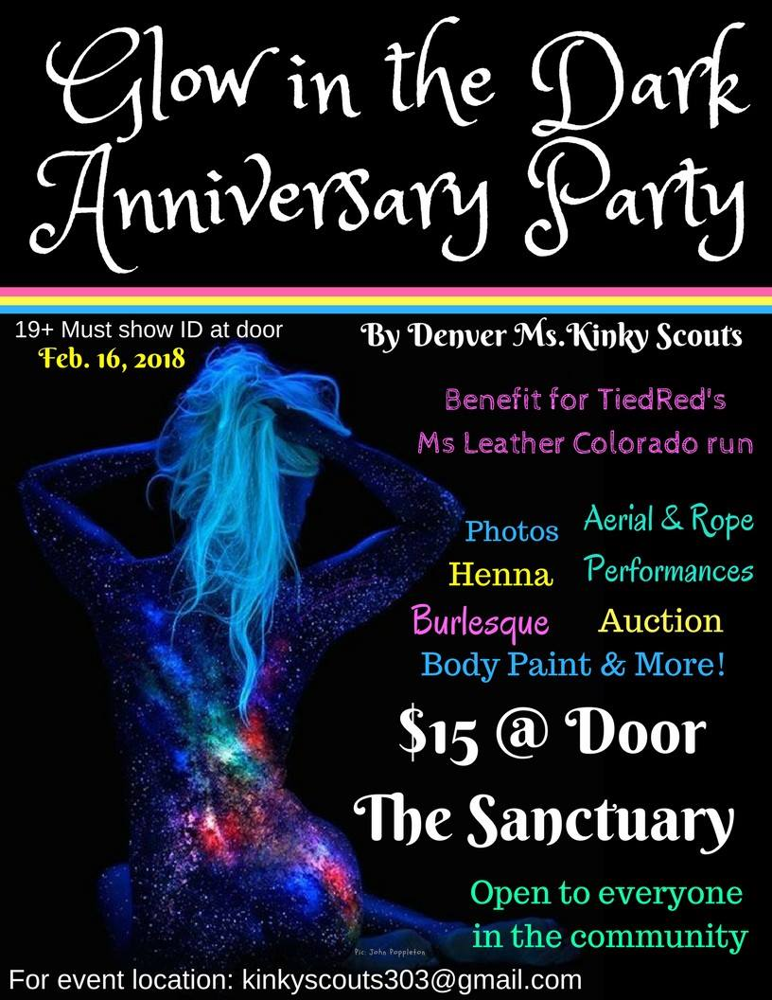

Each time we hold a monthly meeting, we alternate between earning class patches and participating in buffer meetings. The Denver Ms. Kinky Scouts meet every fourth Tuesday of the month to connect on projects, upcoming events, and discuss Scout business.

### Patch Meetings
At our patch meetings, we offer educational classes on a variety of subjects. We encourage a hands-on approach to learning and earning patches to your sash. These meetings are a great opportunity to explore kinks you might not otherwise have experienced and build on practical skills.  

### Buffer Meetings 
During our monthly meetings where we do not earn class patches, we gather for buffer meetings. Buffer meetings can be a variety of gatherings including off-site field trips, themed parties, or a chance to focus on getting to know other Scouts. 

* Christmas Movie Night
* Body Scribble Party
* Anniversary Celebration
* Zoolights
* Tea Party
* Bringing 100%
* Thunder Hangover Party
* Georgia O'Keefe Painting and Wine Night
* Halloween Party
* Sisterhood
* Know Your Rights

___

### Special Events, Service Work, and Other Gatherings 
Outside of our monthly meetings, the Denver Ms. Kinky Scouts gather for a variety of different causes and opportunities. We complete service work, celebrate our communities, and have fun! 

**Books & Ballgags** –This is a bi-monthly gathering open to anyone in the community. At each meeting we dive into a kink-related book while enjoying coffee. Please look for our next event on the FetLife event listings. 

**Colorado Springs Pride Parade & Denver Pride Parade** – Scouts enjoy participating in the Leather Contingency at these Pride Parades! Please help us show our pride at the next parade this summer. 

**BED (Bondage Expo Denver)** – Several Scouts helped us welcome Denver’s first rope convention by volunteering their time and energy by welcoming presenters, helping set-up, and running registration. 

**Exile** – Exile is a community fundraising event focused on education and entertainment. Scouts have donated “Always Prepared” raffle baskets, ran the raffle table, sold raffle tickets, and placed wristbands during this service opportunity.  

**Thunder in the Mountains Hospitality Suite** – We start this big weekend off with a bang in the Hospitality Suite. We have made chocolate treats, pins, a dream door to connect with potential play partners, and a photo booth to share in the Hospitality Suite along with donating raffle baskets for the opening event. 

**Colorado Leather Fest** – Scouts have volunteered to help with registration, picking up presenters from the airport, and checking badges at the door during this popular event.  

**Beer Bust Fundraisers** – These lively and busy fundraisers are a great opportunity to support various organizations within our communities. Scouts have helped pour beer and place wristbands at these events. 

